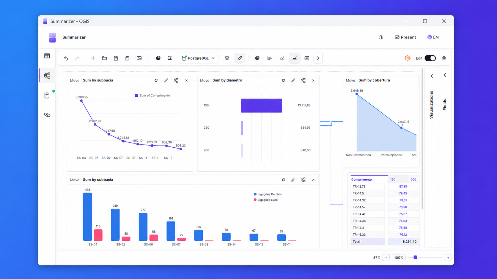
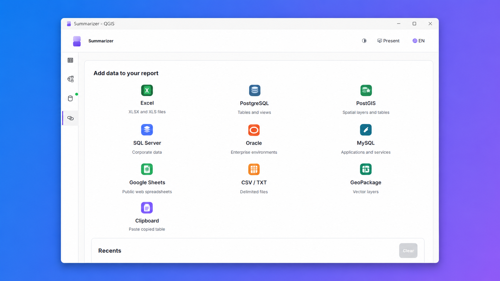
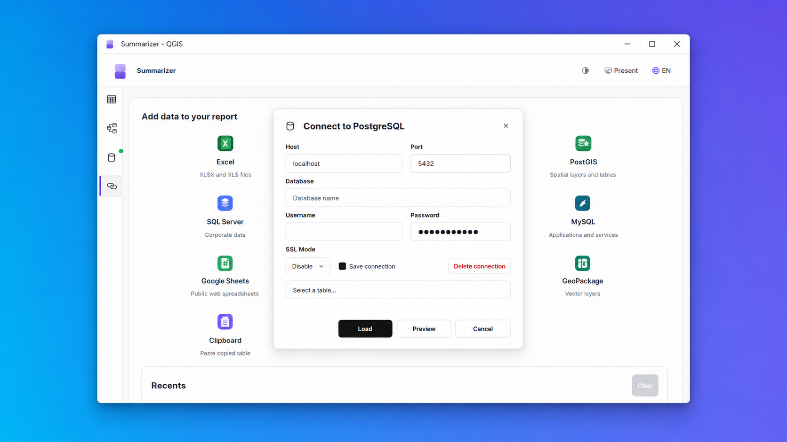
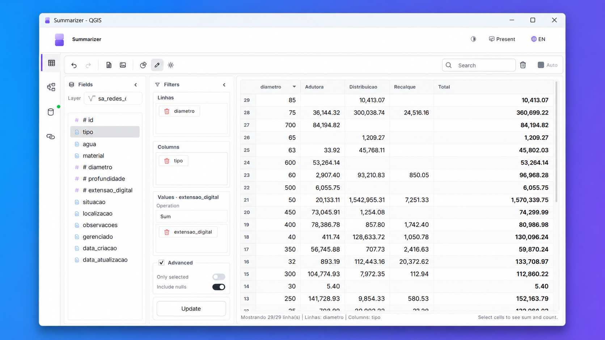

<p align="center">
  
</p>

<h1 align="center">Summarizer</h1>

<p align="center">
  A QGIS plugin for layer summaries, charts, dashboards, and report-ready analytical outputs.
</p>

<p align="center">
  
  
  
  
  
</p>

<p align="center">
  <a href="https://plugins.qgis.org/plugins/Summarizer/">QGIS Plugin Repository</a> &middot;
  <a href="https://github.com/jeandsonmarques/Summarizer#readme">Documentation / README</a> &middot;
  <a href="https://github.com/jeandsonmarques/Summarizer/issues">Issues</a> &middot;
  <a href="https://github.com/jeandsonmarques/Summarizer/releases">Releases</a>
</p>

<p align="center">
  
</p>

<p align="center">
  <strong>Dashboard-ready visualizations directly inside QGIS.</strong>
</p>

## Why Summarizer?

Summarizer helps QGIS users explore project layers faster. It brings layer summaries, charts, dashboard-ready views, and structured analytical outputs into a focused plugin interface built for geospatial work.

Instead of moving data through separate tools for routine inspection and reporting, analysts can review attributes, group values, prepare visual summaries, and organize results while staying inside QGIS.

Core workflows run locally inside QGIS and do not require external services.

## Key features

<table>
  <tr>
    <td><strong>Layer and attribute summaries</strong><br>Inspect fields, group values, calculate totals, and build structured summaries from QGIS layers.</td>
    <td><strong>Chart and dashboard visualizations</strong><br>Create visual analytical views that are ready for dashboards and presentation-oriented reports.</td>
  </tr>
  <tr>
    <td><strong>Data source workflows</strong><br>Connect files, databases, and spatial data sources from one place.</td>
    <td><strong>PostgreSQL/PostGIS connections</strong><br>Prepare tabular and spatial database data for analysis in QGIS.</td>
  </tr>
  <tr>
    <td><strong>Model and connection workflows</strong><br>Organize data relationships and connection-driven analysis flows.</td>
    <td><strong>Export-oriented analytical outputs</strong><br>Prepare structured results for reporting and review.</td>
  </tr>
  <tr>
    <td colspan="2"><strong>Local QGIS execution</strong><br>Run the main analytical workflows in the standard QGIS desktop environment.</td>
  </tr>
</table>

## Screenshots

### Data sources

<p>Connect files, databases, and spatial data sources from one place.</p>

<p>
  
</p>

### PostgreSQL connection

<p>Configure database access and prepare tabular or spatial data for analysis.</p>

<p>
  
</p>

### Dashboard visualizations

<p>Build dashboard-ready charts and analytical views inside QGIS.</p>

<p>
  
</p>

### Layer summary

<p>Summarize layer attributes using rows, columns, values, filters, and totals.</p>

<p>
  
</p>

## Installation

### From QGIS Plugin Repository

1. Open QGIS.
2. Go to **Plugins > Manage and Install Plugins**.
3. Enable experimental plugins.
4. Search for **Summarizer**.
5. Click **Install Experimental Plugin**.

### From ZIP

1. Download `Summarizer-qgis-release.zip` from [Releases](https://github.com/jeandsonmarques/Summarizer/releases).
2. Open QGIS.
3. Go to **Plugins > Manage and Install Plugins > Install from ZIP**.
4. Select the ZIP file.
5. Install the plugin.

## Compatibility

| QGIS version | Status |
|---|---|
| QGIS 3.34 LTR | Supported |
| QGIS 3.44 LTR | Supported |
| QGIS 4.x | Not declared yet |

QGIS 4 compatibility will be evaluated separately after Qt 6 and PyQGIS 4 testing.

## Current status

Summarizer is currently an experimental public QGIS plugin. The plugin is usable and under active public testing, and feedback from real QGIS projects is welcome.

## Roadmap

- Improve documentation and examples.
- Refine dashboard workflows.
- Improve database connection workflows.
- Add more usage examples.
- Evaluate QGIS 4 compatibility separately.

## Feedback and issues

Please report bugs, usability problems, and workflow suggestions in the issue tracker:

https://github.com/jeandsonmarques/Summarizer/issues

Useful reports include:

- QGIS version.
- Operating system.
- Summarizer version.
- Steps to reproduce.
- Screenshot or error message.

## Repository structure

```text
plugin/Summarizer/
docs/images/
scripts/
tests/
```

## License

Summarizer is licensed under `GPL-3.0-or-later`. See [LICENSE](LICENSE).
